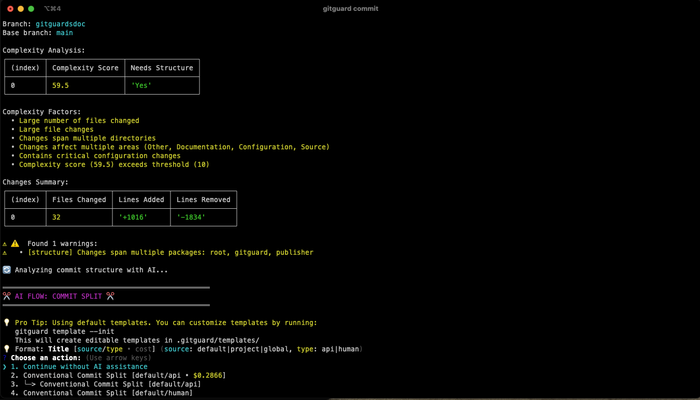

# GitGuard

<div align="center">

> Your AI-powered guardian for maintaining high-quality Git repositories


GitGuard helps developers maintain best practices without slowing them down.

> ⚠️ **Development Status**: GitGuard is under active development. APIs, command options, and configuration formats may change in future versions as I consolidate and improve the features. Please check the changelog for updates before upgrading.

</div>

## 🎥 Demo

<a href="https://deeeed.github.io/universe/gitguard/index.html" target="_blank">
  
</a>

_Click the link above to watch the GitGuard demo video._

<!-- Table of Contents -->
<details>
  <summary>📋 Table of Contents</summary>
  <ol>
    <li><a href="#-why-gitguard">Why GitGuard?</a></li>
    <li><a href="#-quick-start">Quick Start</a></li>
    <li>
      <a href="#-key-features">Key Features</a>
      <ul>
        <li><a href="#️-commit-guardian">Commit Guardian</a></li>
        <li><a href="#-pr-assistant">PR Assistant</a></li>
        <li><a href="#-ai-integration">AI Integration</a></li>
        <li><a href="#-quality-checks">Quality Checks</a></li>
        <li><a href="#-repository-intelligence">Repository Intelligence</a></li>
      </ul>
    </li>
    <li><a href="#configuration">Configuration</a></li>
    <li><a href="#custom-prompts">Custom Prompts</a></li>
    <li><a href="#status">Status</a></li>
    <li><a href="#arthitecture">Architecture</a></li>
    <li><a href="#full-configuration-reference">Full Configuration Reference</a></li>
    <li><a href="#roadmap">Roadmap</a></li>
    <li><a href="#contributing">Contributing</a></li>
    <li><a href="#license">License</a></li>
  </ol>
</details>

## 🤖 Why GitGuard?

Maintaining clean commits, well-structured PRs, and comprehensive changelogs is crucial but time-consuming. GitGuard automates these best practices using AI, helping you:

- Split large commits intelligently
- Generate meaningful commit messages
- Create detailed PR descriptions
- Maintain structured changelogs
- Detect potential issues before they reach review

While there are existing solutions integrated into IDEs (like Cursor or Copilot) or working as PR agents, GitGuard offers unique advantages:

1. **Complete Prompt Control**: Full customization of AI interactions and prompts
2. **Model Flexibility**: Freedom to use and switch between different AI models
3. **Multiple Suggestions**: Get various commit message options to choose from
4. **Complementary Integration**: Works alongside existing tools in your workflow
5. **Open Source**: Full transparency and community-driven development

For a deeper dive into the motivation behind GitGuard, check out our [detailed explanation](./docs/why.md).


## 🚀 Quick Start

```bash
# Install GitGuard globally (recommended)
npm install -g gitguard

# Commit workflows
gitguard commit # Analyze staged changes and get suggestions
gitguard commit analyze --all # Analyze all changes (staged + unstaged) in the current branch
gitguard commit create -m "feat: update login" # Create commit with AI suggestions
gitguard commit --split # Get suggestions to split large commits

# Branch and PR workflows
gitguard branch pr # Preview AI-generated PR title and description
gitguard branch --split # Analyze and split complex branches
gitguard branch pr --draft # Create a draft PR with AI-generated title and description
gitguard branch edit pr # Directly save AI generated values to matching github PR.

# Pro tip: create an alias for the commit command
alias lazycommit="gitguard commit create "
```

> **💰 Cost-Conscious AI Integration**
>
> Working with AI models like ChatGPT or Claude can be costly. GitGuard is designed with an "offline" clipboard capability that allows you to:
>
> - Use the tool without an API key
> - Copy formatted prompts to your clipboard
> - Paste directly into web interfaces (ChatGPT, Claude)
> - Paste the AI response back into GitGuard
>
> **🎯 Customization**
>
> - Templates can be set dynamically
> - Prompts can be redefined per project
> - Configure in `.gitguard/config.json` or globally
> - Use environment variables for sensitive settings

## 🎯 Key Features

### 🛡️ Commit Guardian
- Analyzes commit size and complexity
- Suggests optimal commit structure
- Generates conventional commit messages
- Detects potential issues early

### 📝 PR Assistant
- Generates AI powered titles and descriptions
- Validates against PR templates
- Suggests structural improvements

### 🤖 AI Integration
- Azure OpenAI
- OpenAI
- Anthropic
- Local Custom models

### 🔍 Quality Checks
- Ensures consistent commit style
- Validates dependency changes
- Checks for security issues
- Maintains monorepo integrity

### 📦 Repository Intelligence
- Automatic monorepo detection
- Smart package change analysis
- Cross-package dependency tracking
- PR template management

## Configuration

GitGuard can be configured both globally and locally using the `init` command:

```bash
# Initialize local configuration (in current repository)
npx gitguard init
# Initialize global configuration (user-level)
npx gitguard init -g

# View all configurations
npx gitguard status
```

## Custom Prompts

GitGuard's AI capabilities are fully customizable through a template system. You can:
- Override default templates
- Create custom workflows
- Use offline clipboard mode
- Debug and validate templates

```bash
# Initialize global templates
gitguard template --init --global
# Edit templates in ~/.gitguard/templates/
ls -l ~/.gitguard/templates/
```

See [custom_prompts.md](./docs/custom_prompts.md) for detailed documentation


## Status

GitGuard provides a powerful configuration inspection tool to help you understand your current setup:

```bash
# Show effective configuration
gitguard status

# Show global configuration
gitguard status --global

# Show local project configuration
gitguard status --local
```

The status command shows your effective configuration, combining:
1. Default values
2. Global user settings (`~/.gitguard/config.json`)
3. Project settings (`.gitguard/config.json`)

Example minimal configuration that inherits defaults:
```json
{
  "ai": {
    "enabled": true,
    "provider": "anthropic"
  }
}
```

Running `gitguard status` will show:
- ✅ All inherited default values
- ✅ Your custom overrides
- ✅ Active features and providers
- ✅ Security rules and patterns
- ✅ Complexity thresholds
- ✅ PR requirements

See [Full configuration reference](#full-configuration-reference) for all available options.

## Architecture

### Smart Diff to Template

GitGuard is designed to be an intelligent wrapper around git diffs, focusing on creating optimal context for AI language models (LLMs). Here's how it works:

#### 🎯 Core Concept
GitGuard analyzes your changes and creates tailored prompts for different AI models. Since each model has different context limits and costs, I've implemented two main approaches:

1. **API Format** (`format: "api"`)
   - Optimized for token efficiency
   - Strict output formatting
   - Cost-conscious context selection

2. **Human Format** (`format: "human"`)
   - Richer context inclusion
   - More descriptive prompts
   - Optimized for ChatGPT/Claude web interfaces

#### ⚙️ Configuration
You can fine-tune the diff analysis with:
```json
{
  "ai": {
    "maxPromptTokens": 32000,  // Maximum tokens in generated prompts
    "maxPromptCost": 0.1       // Maximum cost per API call in USD
  }
}
```

#### 🔬 Implementation Details
The current diff algorithm focuses on extracting meaningful changes while respecting token limits. I'm actively working on improvements, including:
- Commit classification for targeted analysis
- Smart chunking for large changes
- Context-aware diff summarization

> 🚧 **Work in Progress**: The diff algorithm is being actively developed. I'm experimenting with using a classifier to determine the best diff strategy based on commit type.

See the implementation in [diff.util.ts](./src/utils/diff.util.ts)


### 🔍 Commit Complexity Analysis

GitGuard analyzes commit complexity to help identify changes that might benefit from being split into smaller, more focused commits.

#### Current Implementation
```json
{
  "analysis": {
    "complexity": {
      "patterns": {
        "sourceFiles": ["src/*", "lib/*"],
        "apiFiles": ["api/*"],
        "criticalFiles": ["package.json", "tsconfig.json"]
      },
      "scoring": {
        "sourceFileScore": 1.0,
        "apiFileScore": 2.0,
        "criticalFileScore": 2.0
      }
    }
  }
}
```

#### Future Improvements
The complexity analysis will become more flexible, allowing custom patterns and scoring:
```json
{
  "analysis": {
    "patterns": {
      "database": ["db/*.sql", "migrations/*"],  // Custom category
      "security": ["auth/*", "crypto/*"],        // Custom category
      "documentation": ["docs/*", "*.md"]        // Custom category
    },
    "scoring": {
      "database": 2.0,      // Custom weight
      "security": 2.0,      // Custom weight
      "documentation": 0.5   // Custom weight
    }
  }
}
```

#### Development Status
- Currently uses predefined categories and scoring
- Moving towards fully customizable patterns and thresholds
- Evaluating value of automatic detection vs. manual `--split` flag
- Gathering user feedback on most useful detection patterns

> 💡 See [analysis.types.ts](./src/types/analysis.types.ts) for current implementation details
> 
> 🔧 Use `--split` flag to manually trigger split suggestions: `gitguard commit --split`

### 🔒 Security Scanning

Gitguard has built in security scanning to catch common mistakes before they make it to your repository:

#### 🚨 What We Detect
1. **Secrets and Keys**
   - API keys
   - Access tokens
   - Private keys
   - Database credentials

2. **Sensitive Files**
   - Environment files
   - Configuration files
   - Certificate files
   - Database files

```bash
📂 Analyzing changes...
⚠️  Security issue detected in .env.development
    High Severity: Potential API key exposure
    
? How would you like to proceed?
❯ Unstage affected files
  Review changes
  Proceed anyway (not recommended)
```

> 🔍 See [security.types.ts](./src/types/security.types.ts) for all security patterns

### 🧠 Repository Intelligence

While AI assistance is GitGuard's primary feature, I've also built in smart repository analysis that works offline:

#### 📦 Monorepo Detection
```bash
# Automatic package detection
"feat: add user auth" → "feat(auth): add user auth"

# Cross-package changes detection
📦 Changes affect multiple packages:
  • packages/api/src/auth.ts
  • packages/web/src/login.tsx
  
? Choose action:
❯ Split into separate commits
  Keep changes together
  Review changes
```

#### 🎯 Smart Scoping
- Automatically detects affected packages
- Suggests optimal commit structure
- Maintains monorepo integrity
- Prevents cross-package tangles

> 🔧 Configure detection patterns in `.gitguard/config.json`:
```json
{
  "git": {
    "monorepoPatterns": ["packages/*", "apps/*"],
    "ignorePatterns": ["*.lock", "dist/*"]
  }
}
```

> 💡 See [commit.service.ts](./src/services/commit.service.ts) for implementation details

## Full Configuration Reference

Create a `.gitguard/config.json` file in your git repository or home directory. The configuration supports JSON with comments (JSONC):

```json
{
  // Git-related configuration
  "git": {
    // Base branch for comparisons (default: "main")
    "baseBranch": "main",
    // Patterns to detect monorepo packages
    "monorepoPatterns": ["packages/*", "apps/*"],
    // Patterns to ignore in all git operations
    "ignorePatterns": ["*.lock", "dist/*"],
    // GitHub integration settings
    "github": {
      // GitHub token (recommended: use GITHUB_TOKEN env var instead)
      "token": "your-token-here",
      // GitHub Enterprise settings
      "enterprise": {
        "url": "https://github.yourcompany.com"
      }
    }
  },

  // Code analysis configuration
  "analysis": {
    // Enable/disable multi-package detection
    "multiPackageDetection": true,
    // Enable/disable complexity analysis
    "complexityDetection": true, // Not implemented yet - currently always enabled
    // Maximum number of lines changed in a single commit
    "maxCommitSize": 500,
    // Maximum number of lines in a single file
    "maxFileSize": 1000,
    // Whether to validate commits against conventional commits specification
    "checkConventionalCommits": true,
    // Complexity analysis settings
    "complexity": {
      // Size thresholds for complexity calculations
      "thresholds": {
        "largeFile": 100,      // Lines that make a file "large"
        "veryLargeFile": 300,  // Lines that make a file "very large"
        "hugeFile": 500,       // Lines that make a file "huge"
        "multipleFiles": 5,    // Number of files to trigger "multiple files" warning
        "manyFiles": 10        // Number of files to trigger "many files" warning
      },
      // Scoring weights for different types of changes
      "scoring": {
        "baseFileScore": 1,        // Base score for any file
        "largeFileScore": 2,       // Additional score for large files
        "veryLargeFileScore": 3,   // Additional score for very large files
        "hugeFileScore": 5,        // Additional score for huge files
        "sourceFileScore": 1,      // Score multiplier for source code files
        "testFileScore": 1,        // Score multiplier for test files
        "configFileScore": 0.5,    // Score multiplier for config files
        "apiFileScore": 2,         // Score multiplier for API files
        "migrationFileScore": 2,   // Score multiplier for migrations
        "componentFileScore": 1,   // Score multiplier for UI components
        "hookFileScore": 1,        // Score multiplier for hooks
        "utilityFileScore": 0.5,   // Score multiplier for utilities
        "criticalFileScore": 2     // Score multiplier for critical files
      },
      // File patterns for categorizing changes
      "patterns": {
        "sourceFiles": ["/src/", "/lib/", "/core/"],
        "apiFiles": ["/api/", "/interfaces/", "/services/"],
        "migrationFiles": ["/migrations/", "/migrate/"],
        "componentFiles": ["/components/", "/views/", "/pages/"],
        "hookFiles": ["/hooks/", "/composables/"],
        "utilityFiles": ["/utils/", "/helpers/", "/shared/"],
        "criticalFiles": [
          "package.json",
          "tsconfig.json",
          ".env",
          "pnpm-workspace.yaml",
          "yarn.lock",
          "package-lock.json"
        ]
      },
      // Thresholds that trigger restructuring recommendations
      "structureThresholds": {
        "scoreThreshold": 10,    // Total complexity score threshold
        "reasonsThreshold": 2    // Number of complexity reasons threshold
      }
    }
  },

  // Security scanning configuration
  "security": {
    // Enable/disable all security features
    "enabled": true,
    "rules": {
      // Secret detection configuration
      "secrets": {
        "enabled": true,
        "severity": "high",
        "blockPR": true,
        // Additional patterns to detect secrets (adds to built-in patterns)
        "patterns": []
      },
      // Sensitive file detection
      "files": {
        "enabled": true,
        "severity": "medium",
        // Additional patterns for sensitive files (adds to built-in patterns)
        "patterns": []
      }
    }
  },

  // AI integration configuration
  "ai": {
    // Enable/disable AI features
    "enabled": false,
    // AI provider: "azure", "openai", "anthropic", "custom"
    "provider": null,
    // Maximum tokens allowed in prompts
    "maxPromptTokens": 32000,
    // Maximum cost allowed per prompt in USD
    "maxPromptCost": 0.1,
    // Enable copying API responses to clipboard
    "apiClipboard": true,
    // Azure OpenAI configuration
    "azure": {
      "endpoint": "https://your-endpoint.openai.azure.com",
      "deployment": "your-deployment",
      "apiVersion": "2023-05-15",
      // API key (recommended: use AZURE_OPENAI_API_KEY env var instead)
      "apiKey": "your-key-here"
    },
    // OpenAI configuration
    "openai": {
      // API key (recommended: use OPENAI_API_KEY env var instead)
      "apiKey": "your-key-here",
      "model": "gpt-4",
      "organization": "your-org-id"
    },
    // Anthropic configuration
    "anthropic": {
      // API key (recommended: use ANTHROPIC_API_KEY env var instead)
      "apiKey": "your-key-here",
      "model": "claude-3-sonnet-20240229"
    },
    // Custom AI provider configuration
    "custom": {
      "host": "http://localhost:11434",
      "model": "codellama"
    },
    // Commit analysis AI configuration
    "commitDetails": {
      "enabled": true,
      "complexityThreshold": 5,
      "alwaysInclude": false
    }
  },

  // Pull Request configuration
  "pr": {
    // PR template settings
    "template": {
      // Path to PR template file
      "path": ".github/pull_request_template.md",
      // Whether template is required
      "required": true,
      // Required sections in PR template
      "sections": {
        "description": true,
        "breaking": true,
        "testing": true,
        "checklist": true
      }
    },
    // Maximum size of PR in lines
    "maxSize": 800,
    // Number of required approvals
    "requireApprovals": 1
  },

  // Enable debug logging
  "debug": false,
  // Enable colored output
  "colors": true
}
```

### Important Notes

1. **Configuration is Optional**: All settings are optional and will use smart defaults if not provided. You only need to configure what you want to customize.

2. **Security Patterns**:
   - Custom patterns in `security.rules.secrets.patterns` and `security.rules.files.patterns` are **added to** the built-in patterns, not replacing them
   - Built-in patterns provide comprehensive security checks out of the box
   - Custom patterns allow you to add organization-specific checks

3. **Sensitive Values**:
   The following values should preferably be set via environment variables:
   - GitHub Token: Use `GITHUB_TOKEN` or `GH_TOKEN`
   - Azure OpenAI Key: Use `AZURE_OPENAI_API_KEY`
   - OpenAI Key: Use `OPENAI_API_KEY`
   - Anthropic Key: Use `ANTHROPIC_API_KEY`

4. **Environment Variables**:
   All configuration options can also be set via environment variables. Here's a complete list:

   **AI Configuration**
   ```bash
   # Enable/Disable AI features
   GITGUARD_USE_AI=true

   # Azure OpenAI
   AZURE_OPENAI_ENDPOINT="https://your-endpoint.openai.azure.com"
   AZURE_OPENAI_DEPLOYMENT="your-deployment"
   AZURE_OPENAI_API_VERSION="2023-05-15"
   AZURE_OPENAI_API_KEY="your-key"

   # OpenAI
   OPENAI_API_KEY="your-key"

   # Anthropic
   ANTHROPIC_API_KEY="your-key"
   ```

   **GitHub Configuration**
   ```bash
   # GitHub Authentication
   GITHUB_TOKEN="your-token"  # or
   GH_TOKEN="your-token"
   ```

   **Security Configuration**
   ```bash
   # Enable/Disable Security Features
   GITGUARD_SECURITY_ENABLED=true

   # Secret Detection
   GITGUARD_SECURITY_SECRETS=true
   GITGUARD_SECURITY_SECRETS_SEVERITY="high"  # high|medium|low

   # Sensitive File Detection
   GITGUARD_SECURITY_FILES=true
   GITGUARD_SECURITY_FILES_SEVERITY="high"  # high|medium|low
   ```

   **Note**: Environment variables take precedence over configuration files. They're particularly useful for:
   - CI/CD environments
   - Keeping sensitive values out of configuration files
   - Temporary overrides during development


## Roadmap

- [x] Add support for Anthropic
- [x] Template engine to customize prompts
- [X] Simulate API calls to debug prompts
- [ ] Add shell auto completions
- [ ] PR Review feature
- [ ] Custom model fine tuning guide (run everything on your own server)

## Contributing

See [CONTRIBUTING.md](./docs/contributing.md)

## License

This project is licensed under the MIT License - see the [LICENSE](../../LICENSE.md) file for details.

---
<sub>Created by [Arthur Breton](https://siteed.net) • See more projects at [siteed.net](https://siteed.net)</sub>
