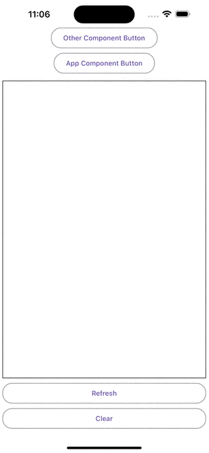

# react-native-logger

react-native-logger is a simple, yet powerful logging library designed for React Native applications. It extends the basic console logging functions by maintaining a log history that can be displayed within your app or exported for troubleshooting. This feature is particularly useful in production environments where direct console access is not possible.




## Installation

```sh
npm install @siteed/react-native-logger
```

## Key Features

- Easy Integration: Seamlessly integrates with any React Native project.
- Persistent Log History: Keeps a history of log messages that can be displayed in-app for easier debugging and diagnostics.
- Flexible Logging Levels: Supports multiple logging levels (debug, info, warn, error) to categorize log output.
- Production Debugging: Facilitates debugging in production by allowing logs to be reviewed directly from a device.

## Usage

To get started with react-native-logger, wrap your application's root component with LoggerProvider. You can then use useLogger within your React components or getLogger outside of them to log messages.

### Basic Setup

```tsx
import { LoggerProvider, useLogger, getLogger } from '@siteed/react-native-logger'

// To use outside react component, you can call getLogger directly
const outLogger = getLogger(`out`);
outLogger.debug(`This is a debug message`);
outLogger.info(`This is an info message`);
outLogger.warn(`This is a warning message`);
outLogger.error(`This is an error message`);

const App = () => {
  const { logger } = useLogger('App')
  useEffect( () => {
    logger.log(`App mounted`)
  })

  return (
    <View>
      <Text>App</Text>
    </View>
  )
}

const WithLogger = () => {
  return (
    <LoggerProvider>
      <App />
    </LoggerProvider>
  )
}
export default WithLogger
```

### Accessing logs in Production

react-native-logger is particularly useful in production, where traditional debugging tools are not accessible. For instance, you can create a dedicated screen within your app that displays log history, allowing users to copy and send these logs for support purposes, or even set up automatic log forwarding via email or a web service.

```tsx
import { LoggerProvider, useLoggerState } from '@siteed/react-native-logger';

const LogScreen = () => {
  const { logs } = useLoggerState();

  const handleSendLogs = async () => {
    const logData = logs.map(log => `${log.timestamp}: ${log.message}`).join('\n');
    await sendLogsToSupport(logData); // Define this function to match your backend support system
  };

  return (
    <View>
      <Text>Log Details</Text>
      <Button title="Send Logs to Support" onPress={handleSendLogs} />
    </View>
  );
};

const App = () => (
  <LoggerProvider>
    <LogScreen />
  </LoggerProvider>
);

export default App;
```

## Contributing

See the [contributing guide](CONTRIBUTING.md) to learn how to contribute to the repository and the development workflow.

## Try it out
```bash
yarn example web
```

## License

MIT

---

Made with [create-react-native-library](https://github.com/callstack/react-native-builder-bob)
